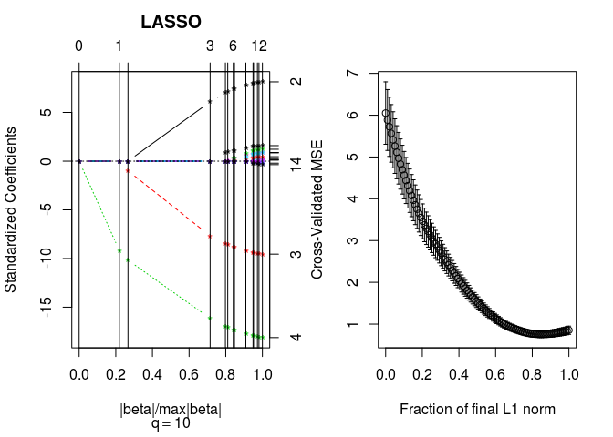
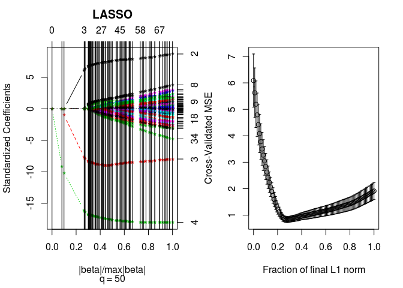
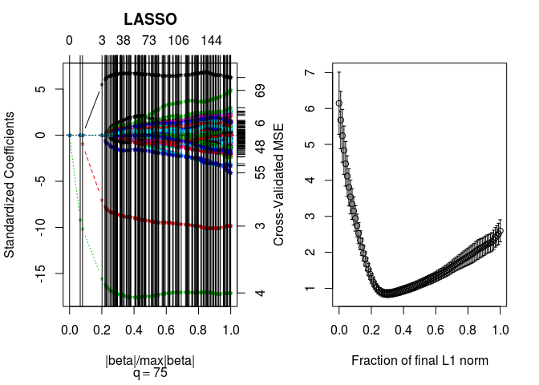
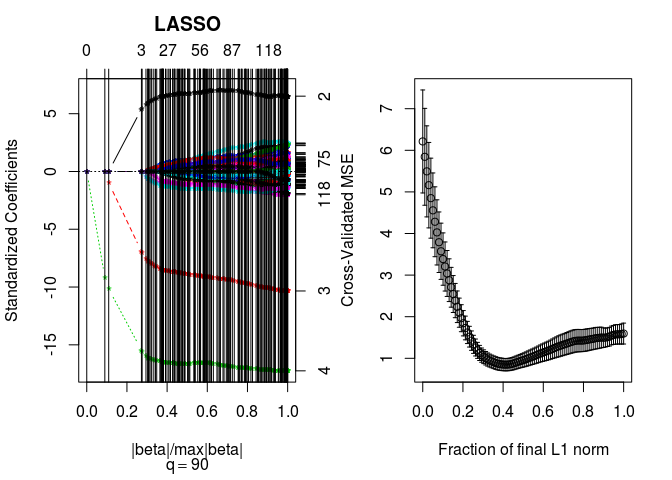
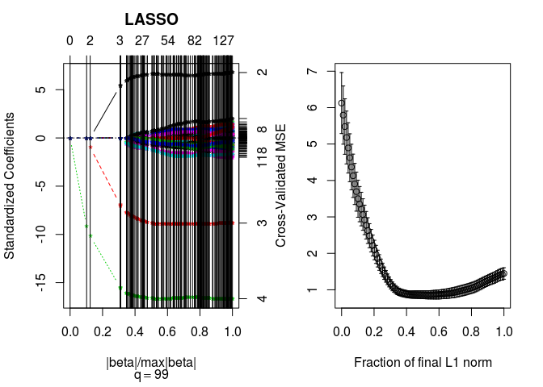

Lasso Regression
================

In this file, I show that how we can use Lasso Regression to do feacture selection. The path that each variable leaves is also plotted.

``` r
library(lars)
```

    ## Loaded lars 1.2

``` r
x0 <- rep(1,100);
x1 <- rnorm(n=100, mean = 0, sd = 1);
x2 <- rnorm(n=100, mean = 0, sd = 1);
x3 <- rnorm(n=100, mean = 0, sd = 1);


eps <- rnorm(n=100, mean=0, sd=.9);

Bet <-  c(2, 1, -1, -2);
X <- cbind(x0,x1,x2,x3)  # or using cbind
y <-  X %*% Bet +eps ;
par(mfrow=c(1,2))

for (q in c(10, 50, 75, 90, 99)) {
    Z1 <- rnorm(100*q,0,1)       
    dim(Z1) <- c(100,q) 
    X<-cbind(X,Z1);
    
    lassoplot<- lars(X,y, type="lasso")
    plot(lassoplot)
    title(sub=bquote(q == .(q)))
    cv.lars(X,y, K = 10,type="lasso")
X    
}
```


